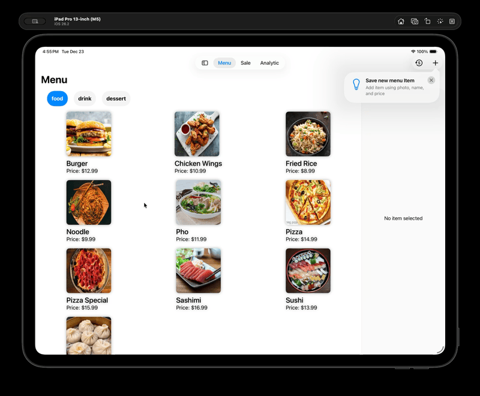
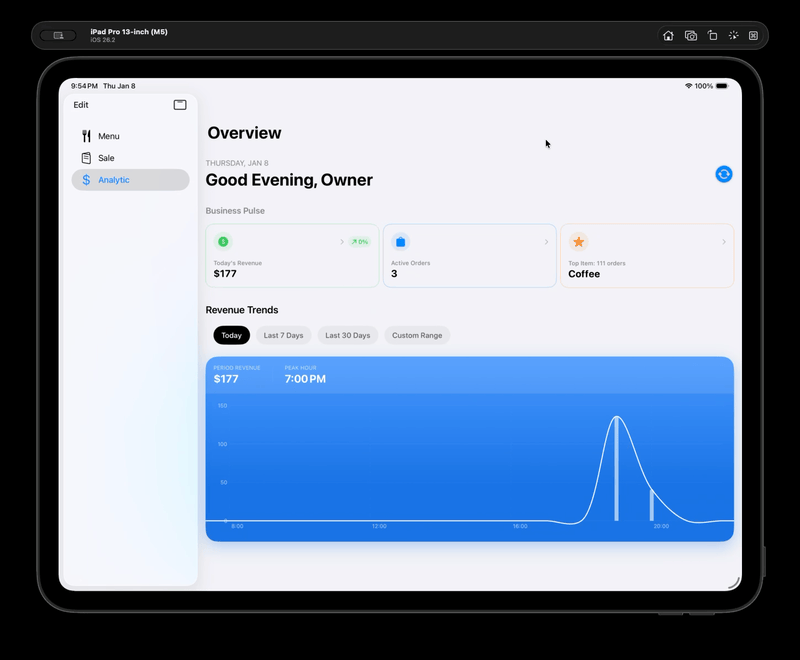

# EasiCash

A SwiftUI + SwiftData iOS app for menu management, sales, and analytics.

## Features

- **Menu** — Browse and manage menu items with categories, checkout, and editing
- **Sale** — Inspect and manage sales
- **Analytic** — View charts and insights (revenue, categories, top products, active orders)

Built with SwiftUI, SwiftData, and a tab-based layout (Menu, Sale, Analytic).

## App Walkthrough

### Menu

### Analytics

## Requirements

- iOS 17+
- Xcode 15+

## License

See [LICENSE](LICENSE).
